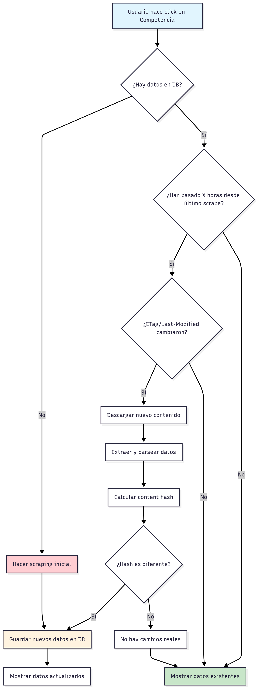

# 🎯 Competitors Scraper - Sistema de Monitoreo de Precios

## **Descripción General**

Sistema inteligente de web scraping para monitorear precios de competencia (Cerini y Mala Peluquería) con mecanismos avanzados de caching, detección de cambios y organización por categorías.

## **🏗️ Arquitectura del Sistema**

### **Componentes Principales:**
- **UI**: Vista integrada en navbar principal (solo admin)
- **API**: Endpoints para scraping y consulta de datos
- **Scrapers**: Módulos especializados para HTML (Cerini) y PDF (Mala)
- **Storage**: Supabase para persistencia de datos y metadatos
- **Cache**: Sistema inteligente basado en ETag, Last-Modified y Content Hash

## **🔄 Flow Completo del Scraper**



**Diagrama del flujo completo del sistema de scraping inteligente con cache avanzado**

## **📊 Mecanismos de Cache**

### **1. ETag (Entity Tag)**
- **Propósito**: Hash único del contenido del servidor
- **Uso**: `If-None-Match` header para verificar cambios
- **Ventaja**: Detección inmediata de modificaciones

### **2. Last-Modified**
- **Propósito**: Timestamp de última modificación
- **Uso**: `If-Modified-Since` header
- **Ventaja**: Control temporal de cambios

### **3. Content Hash**
- **Propósito**: Hash SHA-256 del contenido descargado
- **Uso**: Comparación de contenido real
- **Ventaja**: Detección de cambios incluso con mismo ETag

### **4. Time-Based Cache (TTL)**
- **Propósito**: Intervalo mínimo entre scrapes
- **Configuración**: `MIN_INTERVAL_HOURS` en el código
- **Ventaja**: Evita scraping excesivo

## **🔧 Implementación Técnica**

### **Endpoints API:**

#### **`/api/competitors/refresh` (POST)**
```typescript
// Trigger scraping process
// Query params:
// - force=true: Bypasea cache y TTL
// - nocache=true: Ignora ETag/Last-Modified
```

#### **`/api/competitors/prices` (GET)**
```typescript
// Obtener precios más recientes
// Retorna: { cerini: [...], mala: [...] }
```

### **Scrapers Especializados:**

#### **Cerini Scraper (HTML)**
- **Tecnología**: Cheerio para parsing HTML
- **URL**: `https://cerini.net/servicios/`
- **Datos**: 230+ servicios organizados por categorías
- **Categorías**: Cortes, Coloración, Tratamientos, etc.

#### **Mala Peluquería Scraper (PDF)**
- **Tecnología**: `pdftotext` subprocess
- **URL**: PDF directo de lista de precios
- **Datos**: 86+ servicios con categorías detectadas
- **Categorías**: CORTE Y PEINADOS, TRATAMIENTOS, COLORACIÓN, etc.

### **Base de Datos:**

#### **Tabla `competitor_prices`**
```sql
- source: 'cerini' | 'mala'
- service_name: string
- category: string (normalizado)
- price: number
- currency: string
- captured_at: timestamp
- content_hash: string
```

#### **Tabla `scrape_runs`**
```sql
- source: string
- started_at: timestamp
- finished_at: timestamp
- status: 'running' | 'success' | 'failed'
- items_inserted: number
- error_message: string
```

## **🎨 UI/UX Features**

### **Vista Organizada por Categorías:**
- **Cortes y Peinados**: Servicios de corte y styling
- **Coloración**: Tintes, mechas, balayage
- **Tratamientos**: Keratina, botox, anti-frizz
- **Cauterización**: Tratamientos especializados
- **Otros Servicios**: Lavados, extensiones, maquillaje

### **Características Responsive:**
- **Desktop**: Dos columnas lado a lado
- **Mobile**: Una columna con scroll horizontal en tablas
- **Secciones colapsables** para mejor navegación
- **Contadores** de servicios por categoría

### **Controles de Usuario:**
- **Botón "Refrescar ahora"** para scraping manual
- **Indicador de última actualización**
- **Manejo de errores** con mensajes claros
- **Estados de loading** durante operaciones

## **🚀 Flujo de Datos en Producción**

### **1. Despliegue:**
```bash
git push origin main
# Código se actualiza, permisos se agregan
# Datos existentes se preservan
```

### **2. Primer Acceso:**
- Admin hace login → Ve botón "Competencia"
- Click en botón → Se cargan datos existentes de Supabase
- Si no hay datos → Scraping automático inicial
- Si hay datos → Verificación de cambios en background

### **3. Operación Normal:**
- **Cache inteligente** previene scraping innecesario
- **Detección automática** de cambios reales
- **Actualización transparente** para el usuario
- **Performance optimizada** con datos en memoria

## **⚡ Optimizaciones de Performance**

### **Caching Estratégico:**
- **Datos en memoria** para consultas rápidas
- **Cache de navegador** para assets estáticos
- **Lazy loading** de componentes pesados
- **Debouncing** en operaciones de UI

### **Scraping Eficiente:**
- **Paralelización** de scrapers (Cerini + Mala)
- **Timeout configurado** para evitar bloqueos
- **Retry logic** para fallos temporales
- **Rate limiting** para respetar servidores

## **🔒 Seguridad y Permisos**

### **Control de Acceso:**
- **Solo administradores** pueden ver la vista
- **Permiso**: `canViewCompetitors: isAdmin`
- **Protección**: RLS en Supabase
- **Auditoría**: Logs de todas las operaciones

### **Protección de Datos:**
- **Headers personalizados** para evitar bloqueos
- **User-Agent** identificable como bot legítimo
- **Respeto a robots.txt** implícito
- **Manejo ético** de recursos del servidor

## **📈 Monitoreo y Debugging**

### **Logs del Sistema:**
- **Scraping runs** con timestamps y resultados
- **Errores detallados** con stack traces
- **Performance metrics** de cada operación
- **Debug files** para análisis de contenido

### **Herramientas de Debug:**
- **Debug files** en `/public/competitors-debug/`
- **Content hash** para verificar cambios
- **Metadata** de cada scraping run
- **Estado de cache** en tiempo real

## **🔄 Ciclo de Vida de los Datos**

### **1. Captura Inicial:**
- Scraping completo de ambas fuentes
- Categorización automática de servicios
- Normalización de nombres y precios
- Almacenamiento en Supabase

### **2. Mantenimiento:**
- Verificación periódica de cambios
- Actualización incremental de datos
- Preservación de histórico
- Limpieza de datos obsoletos

### **3. Actualización:**
- Detección automática de cambios
- Scraping selectivo solo de fuentes modificadas
- Merge inteligente de datos nuevos
- Notificación de cambios significativos

## **🎯 Beneficios del Sistema**

### **Para el Negocio:**
- **Monitoreo continuo** de precios de competencia
- **Análisis de tendencias** de precios del mercado
- **Estrategia de precios** basada en datos reales
- **Ventaja competitiva** con información actualizada

### **Para el Usuario:**
- **Interfaz intuitiva** y organizada por categorías
- **Acceso rápido** desde el navbar principal
- **Datos siempre actualizados** sin intervención manual
- **Experiencia responsive** en todos los dispositivos

### **Para el Sistema:**
- **Eficiencia energética** con cache inteligente
- **Escalabilidad** para agregar más competidores
- **Mantenibilidad** con código modular
- **Robustez** con manejo de errores avanzado

## **🔮 Roadmap Futuro**

### **Funcionalidades Planificadas:**
- **Scheduling automático** de scrapes
- **Alertas de cambios** de precios
- **Análisis de tendencias** con gráficos
- **Comparación de precios** entre competidores
- **Notificaciones push** para cambios importantes

### **Mejoras Técnicas:**
- **Machine Learning** para categorización automática
- **API de terceros** para datos adicionales
- **Dashboard analítico** con métricas avanzadas
- **Exportación** de datos en múltiples formatos

---

**Desarrollado para Studio Maker** - Sistema inteligente de monitoreo de competencia
