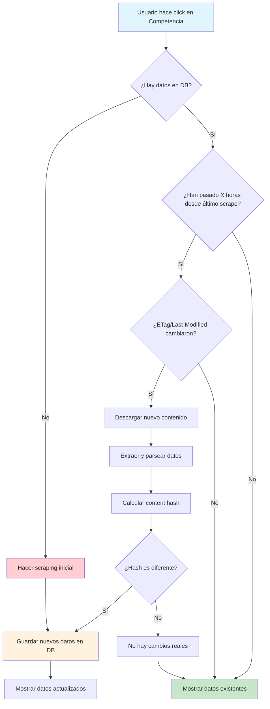

# 🔄 Flow del Scraper de Competencia

## **Diagrama del Flujo Completo**

## **Explicación de Estados:**

- 🔵 **Azul**: Acción del usuario
- 🟢 **Verde**: Datos en cache (sin scraping)
- 🟠 **Naranja**: Nuevos datos guardados
- 🔴 **Rojo**: Scraping inicial forzado

## **Puntos Clave del Flow:**

1. **Cache Inteligente**: Solo se hace scraping cuando es necesario
2. **Detección de Cambios**: Múltiples mecanismos (ETag, Last-Modified, Content Hash)
3. **Eficiencia**: Evita scraping innecesario y respeta servidores
4. **Robustez**: Fallback a datos existentes si falla el scraping
5. **Transparencia**: Usuario siempre ve datos, aunque sean del cache

---

**Ver README completo**: [COMPETITORS_SCRAPER_README.md](./COMPETITORS_SCRAPER_README.md)
