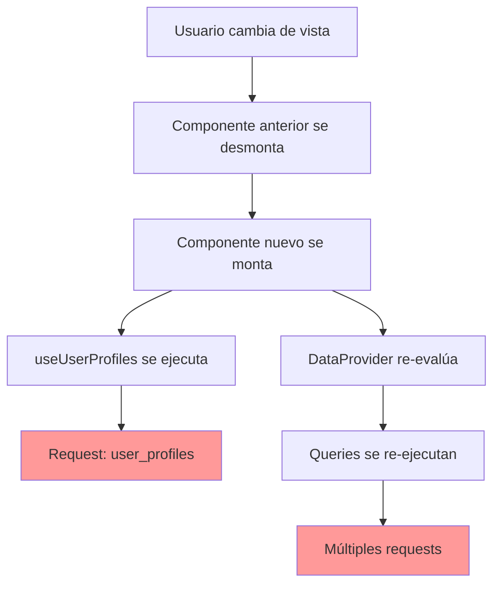

# 🔍 Análisis de Requests - Arquitectura Actual

## Diagrama de Flujo de Requests

```mermaid
graph TD
    A[Usuario carga página] --> B[AuthProvider se monta]
    B --> C[AuthContext verifica sesión]
    C --> D[loadUserProfile ejecuta]
    D --> E[Request: user_profiles]
    
    B --> F[DataProvider se monta]
    F --> G[8 Queries simultáneas]
    G --> H[appointmentsQuery]
    G --> I[clientsQuery]
    G --> J[servicesQuery]
    G --> K[staffSchedulesQuery]
    G --> L[walkInsQuery]
    G --> M[todayOccurrencesQuery]
    G --> N[weekOccurrencesQuery]
    G --> O[monthOccurrencesQuery]
    
    H --> P[Request: appointments]
    I --> Q[Request: clients]
    J --> R[Request: services]
    K --> S[Request: staff_schedules]
    L --> T[Request: walk_ins]
    M --> U[Request: occurrences]
    N --> V[Request: occurrences]
    O --> W[Request: occurrences]
    
    F --> X[Componentes se montan]
    X --> Y[StaffManagementView]
    X --> Z[TimeMetricsView]
    X --> AA[WeekView]
    X --> BB[WeekView2]
    X --> CC[WeekView3]
    X --> DD[WeekView4]
    
    Y --> EE[useUserProfiles hook]
    Z --> FF[useUserProfiles hook]
    AA --> GG[useUserProfiles hook]
    BB --> HH[useUserProfiles hook]
    CC --> II[useUserProfiles hook]
    DD --> JJ[useUserProfiles hook]
    
    EE --> KK[Request: user_profiles]
    FF --> LL[Request: user_profiles]
    GG --> MM[Request: user_profiles]
    HH --> NN[Request: user_profiles]
    II --> OO[Request: user_profiles]
    JJ --> PP[Request: user_profiles]
    
    style E fill:#ff9999
    style P fill:#ff9999
    style Q fill:#ff9999
    style R fill:#ff9999
    style S fill:#ff9999
    style T fill:#ff9999
    style U fill:#ff9999
    style V fill:#ff9999
    style W fill:#ff9999
    style KK fill:#ff9999
    style LL fill:#ff9999
    style MM fill:#ff9999
    style NN fill:#ff9999
    style OO fill:#ff9999
    style PP fill:#ff9999
```

## 🚨 Problemas Identificados

### 1. **DataProvider Over-fetching**
- **8 queries simultáneas** al montar DataProvider
- Se ejecutan **SIEMPRE**, sin importar qué vista esté activa
- Queries como `monthOccurrencesQuery` se ejecutan aunque no se usen

### 2. **Queries Duplicadas de user_profiles**
- **AuthContext**: 1 request
- **6 componentes**: 6 requests adicionales
- **Total**: 7 requests al mismo endpoint

### 3. **Cascada de Re-renders**
- Cada cambio de estado dispara re-renders
- Re-renders causan re-mounting de componentes
- Re-mounting dispara nuevas queries

### 4. **Falta de Lazy Loading**
- Todas las queries se ejecutan al inicio
- No hay carga condicional por vista
- No hay paginación real

## 📊 Conteo de Requests

| Fuente | Cantidad | Endpoint |
|--------|----------|----------|
| AuthContext | 1 | user_profiles |
| DataProvider | 8 | appointments, clients, services, etc. |
| Componentes | 6 | user_profiles (duplicadas) |
| **TOTAL** | **15** | **Por carga inicial** |

## 🔄 Flujo de Cambio de Vista

## 💡 Soluciones Propuestas

### 1. **Lazy Loading por Vista**
- Solo cargar datos necesarios para la vista actual
- Cargar datos adicionales bajo demanda

### 2. **Centralizar user_profiles**
- Una sola query en DataProvider
- Compartir datos entre componentes

### 3. **Query Invalidation Inteligente**
- Invalidar solo queries relevantes
- Evitar re-fetch innecesario

### 4. **Paginación Real**
- Cargar datos en chunks
- Implementar infinite scroll

## 🎯 Próximos Pasos

1. **Identificar qué datos se usan en cada vista**
2. **Implementar lazy loading**
3. **Eliminar queries duplicadas**
4. **Optimizar query keys**
